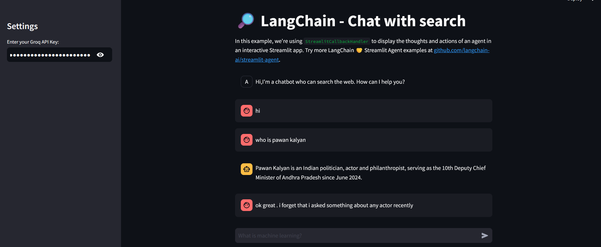

 
#  🔎 LangChain - Chat with Search


This project demonstrates how to build a chatbot using LangChain and Streamlit, integrated with multiple search tools like Arxiv, Wikipedia, and DuckDuckGo. The chatbot can search the web and provide relevant information while displaying intermediate thoughts and actions in the Streamlit interface using StreamlitCallbackHandler.


 

## Features
 
Interactive chat interface with a chatbot powered by LangChain.

Search tools integrated for querying information from:

Arxiv (academic papers)
Wikipedia (general knowledge)

DuckDuckGo (web search)

Real-time StreamlitCallbackHandler to display agent actions and thoughts as the conversation progresses.

Customizable API key input via the Streamlit sidebar for Groq LLM.


5)LangSmith Tracking: Tracks API requests and responses using LangSmith

## Getting Started
### Prerequisites
 
Python 3.8+

LangChain and Streamlit libraries.

Groq API key for accessing the LLM model.
### Tools and Libraries Used
LangChain: Framework for creating agents and chains that interact with LLMs.

Streamlit: A Python library to build interactive web apps.

ArxivAPIWrapper: Tool for searching Arxiv academic papers.

WikipediaAPIWrapper: Tool for fetching content from Wikipedia.

DuckDuckGoSearchRun: Tool for searching the web with DuckDuckGo.

Groq LLM: Groq’s language model used to generate responses based on the query.

 
### Project Structure
 

```bash
📁 langchain-chat-search/
│
├── main.py                 # Main application file with Streamlit and LangChain integration
├── .env                    # Environment file to store API keys securely
├── requirements.txt         # Python dependencies for the project
└── README.md                # This README file


```
     

### Customization
LLM Model: The model used is Llama3-8b-8192 via ChatGroq, but you can replace this with other models by modifying the ChatGroq instance in the main.py file.

Search Tools: This app uses Arxiv, Wikipedia, and DuckDuckGo for search results. You can add or remove tools by modifying the tools list
 

 ### Chat Interaction



### Key Additions:
- **Explore More Chatbots Section**: Added your phrasing to explain how users can explore more chatbot examples either by looking into the `app.py` file or by running the app to explore options on the UI.
  
This update provides clear instructions on where to find more chatbot examples and interact with them.

